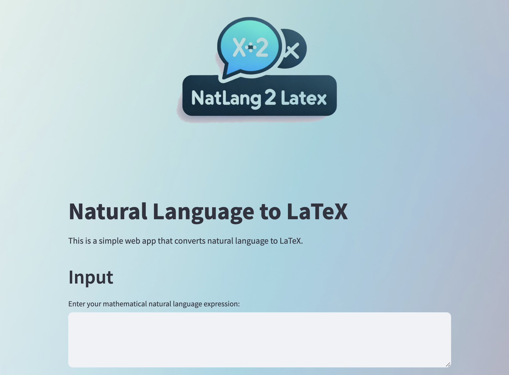

# NatLang2Latex

This is a simple natural language to LaTex converter using Google Gemini

## Usage

1. Either use the devcontainer included, or have `poetry` installed. Navigate to the root of the project and run

```terminal
poetry install
```

2. Obtain a Google API ke from [Google dev AI](https://ai.google.dev/), create a `.env` file and fill it in based on the example in `.env.example`. If you want to contribute, you can also run the following set of commands.

```terminal
poetry install --with dev
```

3. Run the application using the following command

```terminal
poetry run streamlit run main.py
```

which should open up the application locally hosted in your default browser



## Tests

Run tests with

```terminal
pytest projects/NatLang2Latex
```
